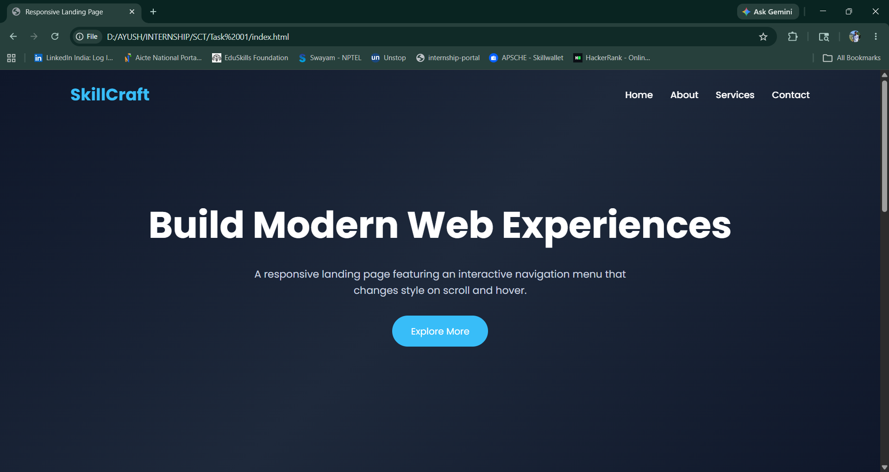
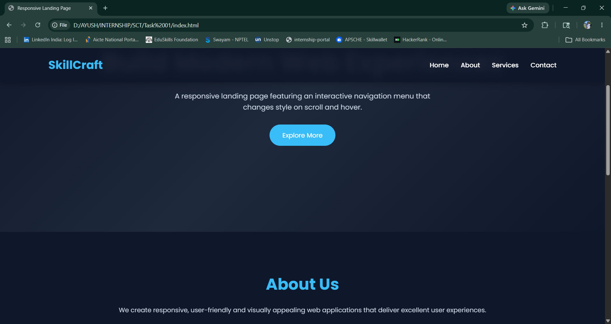
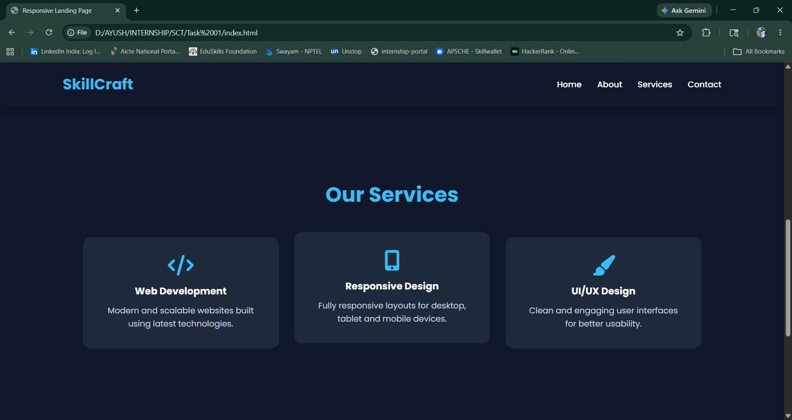
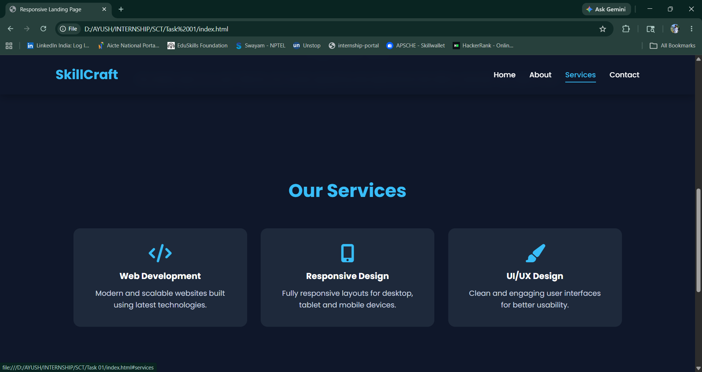
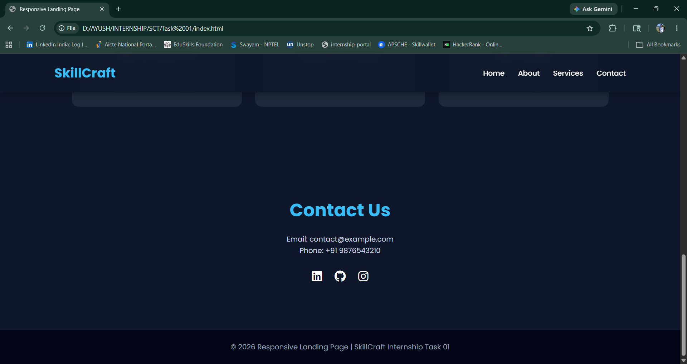

# Responsive Landing Page

## Task 01 - SkillCraft Technology Internship

This project was developed as part of the SkillCraft Technology Web Development Internship Program.

### Objective

Create an interactive navigation menu that:

- Has a fixed position on all pages
- Changes style when scrolling
- Changes appearance when hovering over menu items
- Is fully responsive across devices

---

## Features

✅ Fixed Navigation Bar

✅ Scroll-based Navbar Styling

✅ Hover Effects on Navigation Links

✅ Mobile Responsive Design

✅ Hamburger Menu for Small Screens

✅ Smooth Scrolling Navigation

✅ Active Section Highlighting

✅ Modern User Interface

---

## Technologies Used

- HTML5
- CSS3
- JavaScript (ES6)

---

## Project Structure

```text
SCT_WD_1/
│
├── index.html
├── style.css
├── script.js
├── README.md
└── screenshots/
```

---

## Screenshots







---

## How to Run

1. Download or clone the repository

```bash
git clone https://github.com/koayush1310/SCT_WD_1
```

2. Open the project folder

3. Run index.html in any browser

---

## Learning Outcomes

Through this project, I learned:

- Responsive Web Design
- Navigation Bar Design
- DOM Manipulation
- Event Handling in JavaScript
- Mobile-first Development
- User Interface Enhancement

---

## Author

Ayush Konchada

Web Development Intern

SkillCraft Technology

---

## Repository Name

SCT_WD_1